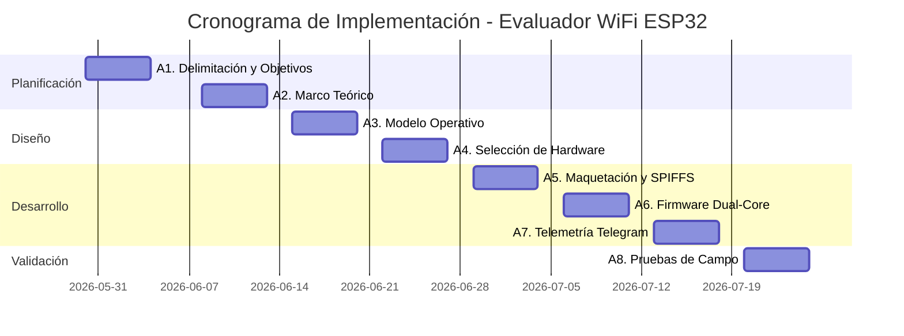

# 📅 Cronograma del Proyecto de Titulación

## Plan de Actividades

| Código | Actividad | Duración | Fecha Inicio | Fecha Fin |
|--------|-----------|----------|--------------|-----------|
| **A1** | Delimitación del problema y objetivos | 5 días | 30/05/2026 | 05/06/2026 |
| **A2** | Investigación bibliográfica y Marco Teórico | 5 días | 08/06/2026 | 12/06/2026 |
| **A3** | Diseño del Modelo Operativo y propuesta inicial | 5 días | 15/06/2026 | 19/06/2026 |
| **A4** | Selección de hardware y diseño de matriz QFD | 5 días | 22/06/2026 | 26/06/2026 |
| **A5** | Maquetación del portal cautivo y almacén SPIFFS | 5 días | 29/06/2026 | 03/07/2026 |
| **A6** | Programación del firmware dual-core | 5 días | 06/07/2026 | 10/07/2026 |
| **A7** | Integración de telemetría segura | 5 días | 13/07/2026 | 17/07/2026 |
| **A8** | Pruebas de campo perimetrales y costos | 5 días | 20/07/2026 | 24/07/2026 |

---

## Diagrama de Flujo del Cronograma

